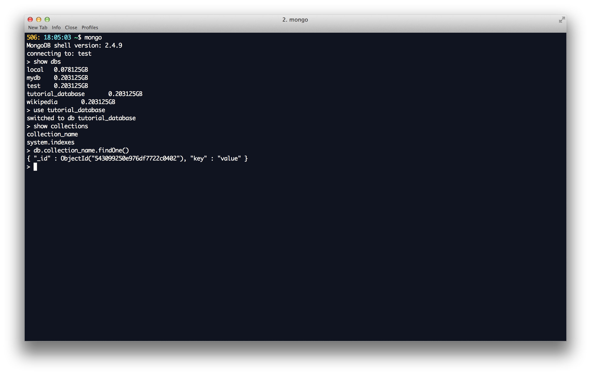

# Getting started with MongoDB
<br>
## The first thing you have to do to start a Mongo Database,
1. Open up a new terminal window, and type in `mongod`
1. I like to minimize it that window because you dont use it any more, but it has to stay open.
1. **That first terminal window must stay open the entire time you are working with your database**

<br>
## The very basics of the mongodb shell.
2. Open a second terminal window, and type in `mongo` **not `mongod`**
1. Type in `show dbs` to show your Mongo Databases.
1. To open or use a database, type in `use <database name>`
1. After you type the `use` command, your database name is now just `db.`

2. Think of this database as a collection of csv files, or SQL tables, or pandas dataframes.  In mongodb these tables are called `collections`
2. To show all the collections in a database, type `show collections`

3. To access a collection, just type in `db.collection_name.<function you wish to do>()`



## Mongodb in the shell is Javascript.
Dont worry, there is a great python wrapper we will be using, however, there is a list of some things that are handy to be able to do in javascript in the mongo shell.

1. To create any new document (think of like a new entry kind of like a new row) `db.collection_name.insert( {key: 'value'} )`
2. To see everything in that database: <br> `db.collection_name.find()` <br>
[ it has an auto limit of 5, type `it` forto see more ]
3. To add to an existing value `db.collection_name.update( {"key": "value"}, {$set: {awesomeness: 99} } )`

## This should be just enough to get you started with Mongodb shell.
**For more information check the book in our library 'MongoDB In Action'**
**For a great cheat sheet, check out the MongoDB-CheatSheet-v1_0.pdf in this repo.**

## PyMongo

```python
# before using pymongo, you must open a new terminal window and type in 
# $ mongod
import pprint as pp

# ! pip install pymongo
from pymongo import MongoClient

# CONNECT TO THE DATABASE
client = MongoClient('mongodb://localhost:27017/')

# CREATE AND/OR USE THIS DATABASE
db = client['tutorial_database']

# INSEPCT THE DATA BASE
db.collection_name.find_one() == db['collection_name'].find_one()

some_data = {"Rapper": "Lil Wayne",
             "Birth-Name": "Dwayne Michael Carter",
             "Best Rapper Alive": True,
             "Occupations": ['Rapper', 'songwriter', 'producer','money getter', 'player'] 
             } 
db.collection_name.insert(some_data)

some_data = {"ID": "Lil Wayne",
             "Label": "Cash Money",
             "Occupation": "Rapper",
             "Albums": ["Tha Block Is Hot", 'Lights Out', '500 Degreez', 'Tha Carter', 'Tha Carter II', 'Like Father Like Son', 'Tha Carter III', 'Rebirth', 'I Am Not A Human Being', 'Tha Carter IV', 'I Am Not A Human Being II', 'Tha Cater V'] }

db.collection_name.insert(some_data)

db.collection_name.remove({"Rapper": "Lil Wayne"})

db.collection_names()

db.collection_name.find_one( {"ID": "Lil Wayne"} )

# OR...
for x in db.collection_name.find( {"ID": "Lil Wayne"} ):
    print x

#    {u'Albums': [u'Tha Block Is Hot', u'Lights Out', u'500 Degreez', u'Tha Carter', u'Tha Carter II', u'Like Father Like Son', u'Tha Carter III', u'Rebirth', u'I Am Not A Human Being', u'Tha Carter IV', u'I Am Not A Human Being II', u'Tha Cater V'], u'_id': ObjectId('5432d48a21dc020481ee96ab'), u'Label': u'Cash Money', u'ID': u'Lil Wayne', u'Occupation': u'Rapper'}

more_data = {"ID": "Kanye West",
             "Occupation": "Rapper",
             "Label": "Roc-A-Fella",
             "Albums": ['The College Dropout', 'Late Registration', 'Graduation',  '808s & Heartbreak', 'My Beautiful Dark Twisted Fantasy', 'Watch the Throne', 'Yeezus'] }

db.collection_name.insert(more_data)

#=> ObjectId('5432d48f21dc020481ee96ac')

# db.collection_name.remove({"Rapper": "Lil Wayne"})
# db.collection_name.remove({"ID": "Lil Wayne"})
# db.collection_name.remove({"ID": "Kanye West"})

for i in db.collection_name.find():
    print pp.pprint(i)
    print "-----------"

# COUNT THE NUMBER OF DOCUMENTS IN YOUR TABLE
db.collection_name.count()

# COUNT THE NUMBER OF ITEMS THAT MATCH YOUR QUERY
db.collection_name.find({"Occupation": "Rapper"}).count()
```
