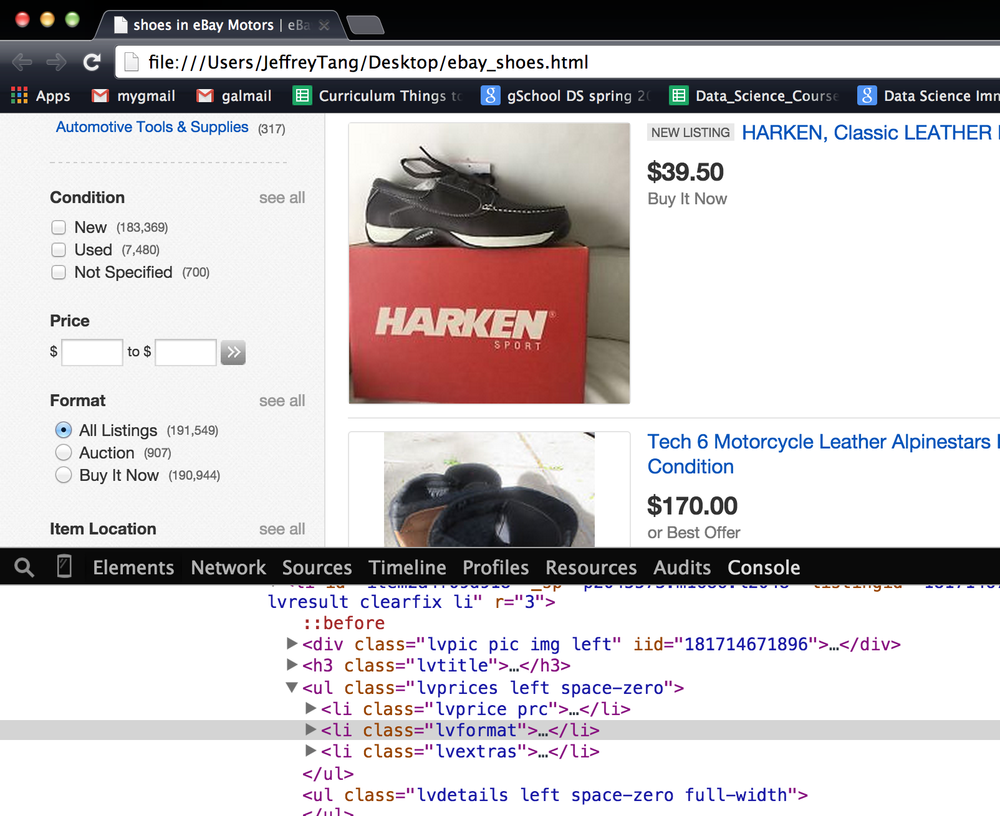

##Part 1: Practice CSS Selectors

CSS selectors are an important part of web scraping as they allow you to select content on a web page. Refer to 
this [document](css_selector_cheatsheet.pdf) if you need a reminder of the CSS selectors that are available to you.
The best way to test out CSS selectors is to use the `Inspect Element` tool in the Google Chrome browser. We will
walk through the work flow in the exercise below.

 

1. Open up `data/ebay_shoes.html` with Google Chrome. It should be as shown below.
   

2. Right click on the first shoe image and click `Inspect Element` to bring up a panel, as seen below.
   

3. Construct a CSS select that would allow you to select every shoe image on the page.
   The CSS selector should be referring to the `img` tag of a particular class. 
   Click `Console` to switch to the console mode. Select the CSS selector by entering into the console 
   `$('your css selector')`. Hover over one of the selected elements, it should be as seen below.

   

4. Open up IPython in your terminal and import BeautifulSoup4 with the line `from bs4 import BeautifulSoup`.
   Read `data/ebay_shoes.html` in as one string from the file and put it into a `BeautifulSoup()` with the 
   line `soup = BeautifulSoup(html_str)`. 

   You should be able to use the CSS selector on the soup using `soup.select('your css selector')`. It will 
   then return a list of tags that each contains the source of the image location. Create a list of the paths to the    image locations by looping through the tags and accessing the image path by `tag['src']`.

5. Open the file paths and read the files in as string. Write them to a new directory named `images`. Open the   
   files in the `images` directory to ensure the images are saved properly.

6. This is the basic work flow of web scraping with CSS selectors. Realistically you would not be reading in a local
   html file, but read the html file from a link instead. Go to ebay, search for your a product of your choice and 
   copy the link. Use the `get` function in the [`requests` library](http://docs.python-requests.org/en/latest/)
   to retrieve the html. The `get` function returns a response where `response.content` returns the html as a 
   string.
   
7. Retrieve the product descriptions from your selected page by following the web scraping work flow.  

##Part 2: Using an API

We do not always have to web scrape. Sometime the web site provides an API to access the information. The API 
is usually easier to use then constructing your own CSS selector. In the following exercise we will be using the NYT [API](http://developer.nytimes.com/docs/read/article_search_api_v2) to programmatically retrieve its articles.

1. Obtain an API key from the NYT for the Article Search API: [http://developer.nytimes.com/apps/register](http://developer.nytimes.com/apps/register)
2. Now that we have access we can begin to have some fun!  Make a request to the article search API endpoint to retrieve the articles for last week.  
    * Look for what [parameters](http://developer.nytimes.com/docs/read/article_search_api_v2) you can set in your request using the API
    * Use [Requests](http://docs.python-requests.org/en/latest/) to interact with the API.
3. Examine one of the articles returned.  Look at it's structure and the fields returned.  Make sure you can get a single article (and you know what it looks like) before you retrieve __ALL__ of the NYT.
4. Now that you have some experience with the API and can sucessfully access articles with associated metadata, it is time to start storing them in [MongoDB](http://www.mongodb.org/)!

### MongoDB interlude

You should have a MongoDB [daemon](http://docs.mongodb.org/manual/tutorial/manage-mongodb-processes/) running on your machine.  It is here that you will be storing all of your data, but be aware of how many articles you are crawling.

Each [database](http://docs.mongodb.org/manual/reference/glossary/#term-database) has a number of [collections](http://docs.mongodb.org/manual/reference/glossary/#term-collection) analogous to SQL tables.  And each collection is comprised of [documents](http://docs.mongodb.org/manual/reference/glossary/#term-document) analogous to a rows in a SQL table.  And each document has [fields](http://docs.mongodb.org/manual/reference/glossary/#term-field) analogous to SQL columns.  Also, the docs have made a more comprehensive [comparison](http://docs.mongodb.org/manual/reference/sql-comparison/).

1. Try storing the document you retrieved earlier in MongoDB (be careful to not store duplicates!).  We will be using the [pymongo](http://api.mongodb.org/python/current/tutorial.html) library to interface to MongoDB from Python.
2. Now see if you can query the database for the article you just stored.
3. Now that you can store and retrieve articles in the Mongo Database, it is time to iterate!

### Scaling up

4. Now that you have a sense of what a single article response looks like, we can begin to scale up.  Begin downloading all of the NYT articles starting with the most recent.  You will not have time (or effort) to download all of the corpus, so let us start with the most recent articles and download as many as we can!  Store these in mongoDB.
5.  Inspect how many articles were returned from your request for all of the NYT.  
    * How many documents are there?  
    * How many total articles are there in all of the NYT?  
    * Look to the API docs for the Article Search API to learn about why there is a discrepancy between these two numbers (and how to find the second number -- total articles)
6. The NYT does some things to prevent us from getting it's articles.  But we are clever data scientists (cleverer than the NYT API that is)!
    * Find out how to circumvent the API pagination.
    * The NYT is rate limited.  Deal with it.
    * The API only lets you access a fixed number of pages (from the pagination).  What is this number and how can you get around this limit?
7. Once you have figured how to deal with the NYT quirks, we are ready to start looping.  Begin to download the 10,000 most recent NYT articles.
    * You will want to check how your loop is progressing, be sure to print some checkpoint information on how many documents it has downloaded (maybe every 100 articles?).  

### Where are we 

* We have successful gathered article metadata from the NYT API
* We have stored said data in MongoDB
* We have URLs for each article that we can now use for scraping

8. Do you remember James Cropcho of [Data Science Pyramid](https://github.com/zipfian/lectures/blob/master/whiteboards/data_science_pyramid.jpg) fame?  Well he coincidentally is also James Cropcho of [Variety](http://blog.mongodb.org/post/21923016898/meet-variety-a-schema-analyzer-for-mongodb) fame!  Use the Variety [library](https://github.com/variety/variety) to analyze the returned documents.
    * How many have a headline?  What about a Headline kicker?
    * How many have multimedia?
    * What about a web URL? Do all of them?  I bet articles published before 1991 are less likely to have a web URL.

### Step 4: Augmentation!  Time to remix the web...

9. Now that we have all the meta data, it it time to get the article content!  We will be doing something I call a data join (some people call it [data blending](http://www.tableausoftware.com/videos/data-integration)... but they charge you money so they can call it that).
    * Iterate over your collection in your database.  For all the articles for which you do not have HTML content (this will be all of them to begin with), use the 'web url' in the meta data to make a web request.
    * Use Beautiful Soup to parse the returned HTML. Make sure to initialize your soup with: `BeautifulSoup(response.text, 'html.parser')`
    * Augment your meta data in the database with this raw HTML from the web page.
    * The web page has much more than just the article content.  Find out how to extract just the article body and store this in the database as well.
    * Store __both__ the raw HTML and the article content in the database.

### Congratulations!

You have made it to the end (hopefully succcessfully).  Now that you have your data and have contextualized it with information from the web, you can start performing some interesting analyses on it.

## Extra Credit

### User Login

Scraping sites is easy when you can have clear access to the content and it is in a semi-structured form.  One issue that arises with scraping sites is the need to login.  

1. Find a site that you might want to get data from that requires a login.

* Use [Mechanize](http://wwwsearch.sourceforge.net/mechanize/) to login to a site to scrape.
* [Mechanize For Beginners](http://www.pythonforbeginners.com/mechanize/browsing-in-python-with-mechanize/)
* [Mechanize Login Tutorial](http://simplapi.wordpress.com/2012/04/20/pythons-mechanize-login-like-a-user/)
* Example code in [advanced_scraping.ipynb](advanced_scraping.ipynb)

### Client side templating

Some sites do what is called [client side templating](http://www.smashingmagazine.com/2012/12/05/client-side-templating/), basically you send only data from the server and write a bunch of Javascript to dynamically write HTML when the page loads.

1. Find a site that templates on the client.
2. Look at the [Chrome Developer Tools](http://thewc.co/articles/view/web-inspector-tutorial) to find which "Resource" the data came in. __Hint Hint, look for a JSON file__

### Automated Scraper

Scraping the web from your laptop is great, but what if you want to automate things and have a long running process (scraping for days...)?  A common solution is to setup a script that continuous scrapes the web from a hosted virtual server on something like Amazon Web Service (AWS).

1. Follow along on the auxiliary AWS sprint here: [https://github.com/zipfian/aws-and-the-cloud](https://github.com/zipfian/aws-and-the-cloud#assignment)
2. Setup an automated scraper on AWS using [cron](http://www.unixgeeks.org/security/newbie/unix/cron-1.html) or a [python scheduler](https://github.com/dbader/schedule)
3. Save the scraped files to [S3](http://aws.amazon.com/s3/) or a database.

### Proxy

Some sites block IPs from know bad actors.  LinkedIn actually does this for any Amazon Web Services (AWS) IP address.  But us being the smart data scientists we are, we will devise a solution!

[Tor](https://www.torproject.org/) is a lovely community built around anonymization on the web.  Tor allows for users to browse the web anonymously by daisy chaining a request across a network of nodes to hide the origin IP of the request.

1. Using Tor and its [Python client](https://stem.torproject.org/tutorials.html), try to setup a scraper that is anonymized.  Bonus points if you host your scraper on AWS and successful can scrape LinkedIn profile pages.
